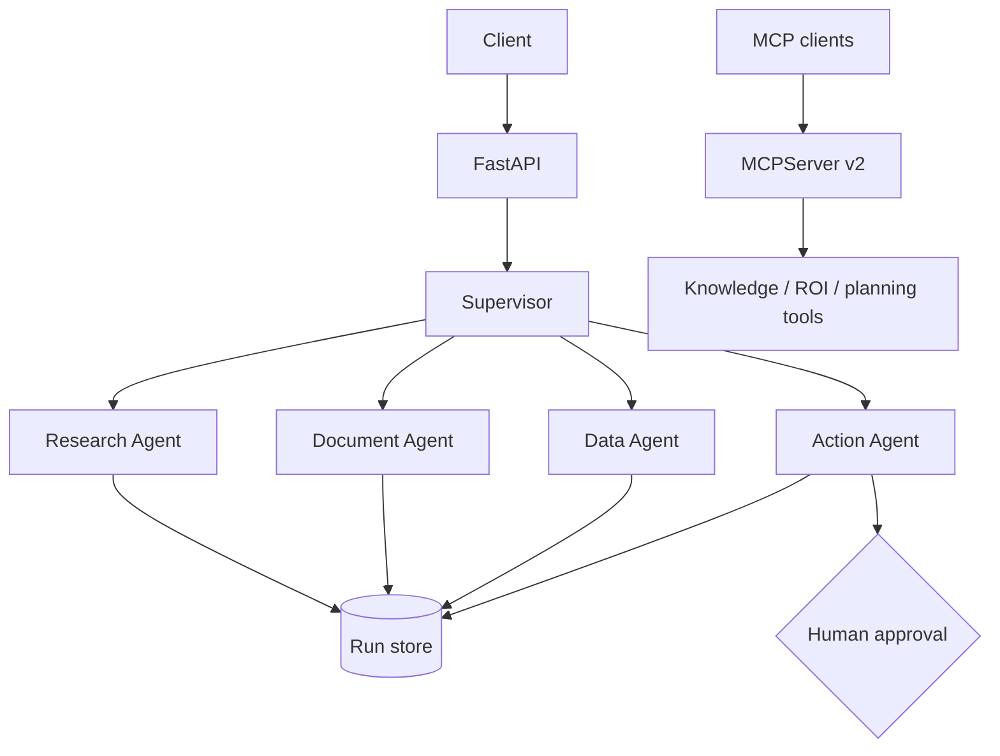

# Multi-Agent Business Assistant

[Русская версия](README_RU.md)

A **LangGraph** multi-agent backend that routes business requests to specialist agents, persists runs, requires human approval for action-oriented requests, and exposes reusable tools through the **Model Context Protocol (MCP)**.

## Architecture



## What it demonstrates

- LangGraph state graph and conditional routing;
- supervisor + specialist agent pattern;
- OpenAI-backed routing and generation in live mode;
- deterministic `DEMO_MODE=true` so the repository runs without paid APIs;
- human-in-the-loop boundary before high-impact actions;
- persisted run/audit state;
- separate MCP v2 server exposing typed tools;
- FastAPI, Docker, tests and CI.

## Agents

| Agent | Purpose |
|---|---|
| Research | Finds relevant local knowledge and synthesizes context |
| Document | Analyzes only supplied document/context text |
| Data | Handles numeric/business-analysis requests |
| Action | Creates an action proposal and forces human approval |

## Run the API

```bash
cp .env.example .env
docker compose up --build
```

The default is demo mode. Set `DEMO_MODE=false` and provide `OPENAI_API_KEY` for live LLM routing and specialist responses.

API: `http://localhost:8001/docs`

## Run the MCP server

```bash
pip install -e .
python -m app.mcp_server
```

The MCP server uses the current SDK v2 style and exposes typed tools for knowledge lookup, ROI calculation and action-plan preparation.

## Safety design

The action agent **never performs an external side effect**. It produces a proposal with `pending_approval`, and `/v1/agent/runs/{run_id}/approve` records explicit approval. A real integration can attach execution only after that state transition.

## License

MIT
